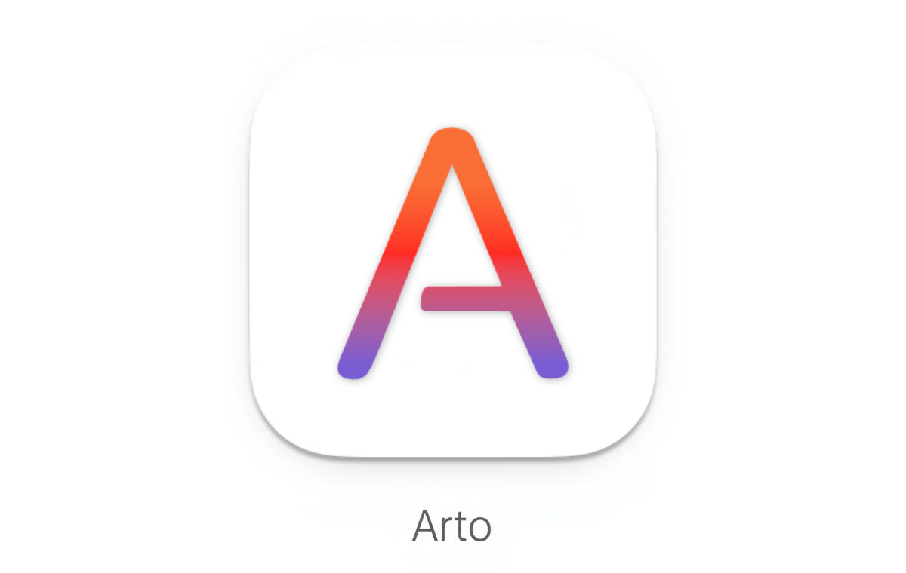

**Arto — the Art of Reading Markdown.**

A local app that faithfully recreates GitHub-style Markdown rendering for a beautiful reading experience.

## Philosophy

Markdown has become more than a lightweight markup language — it's the medium for documentation, communication, and thinking in the developer's world. While most tools focus on _writing_ Markdown, **Arto is designed for _reading_ it beautifully**.

The name "Arto" comes from "Art of Reading" — reflecting the philosophy that reading Markdown is not just a utility task, but a quiet, deliberate act of understanding and appreciation.

Arto faithfully reproduces GitHub's Markdown rendering in a local, offline environment, offering a calm and precise reading experience with thoughtful typography and balanced whitespace.

## Features

- **GitHub-Style Rendering**: Accurate reproduction of GitHub's Markdown styling
- **Refined Typography**: Thoughtful design focused on readability and visual balance
- **Native Performance**: Built with Rust for fast, responsive rendering
- **Auto-Reload**: Automatically updates when the file changes on disk
- **Dark Mode**: Automatic theme switching based on system preferences
- **Drag & Drop**: Simply drag markdown files onto the window to open them
- **Live Navigation**: Navigate between linked markdown documents
- **Offline First**: No internet connection required — read your docs anytime, anywhere

## Installation

### From Source

```bash
git clone https://github.com/lambdalisue/rs-arto.git
cd rs-arto
cargo build --release
```

The binary will be available at `target/release/arto`.

## Usage

Launch the application to see the welcome screen with keyboard shortcuts and usage instructions.

## Development

### Prerequisites

- Rust 1.70 or higher
- Cargo

### Running in Development

```bash
cargo run
```

### Building for Production

```bash
cargo build --release
```

## License

See [LICENSE](LICENSE) file for details.
