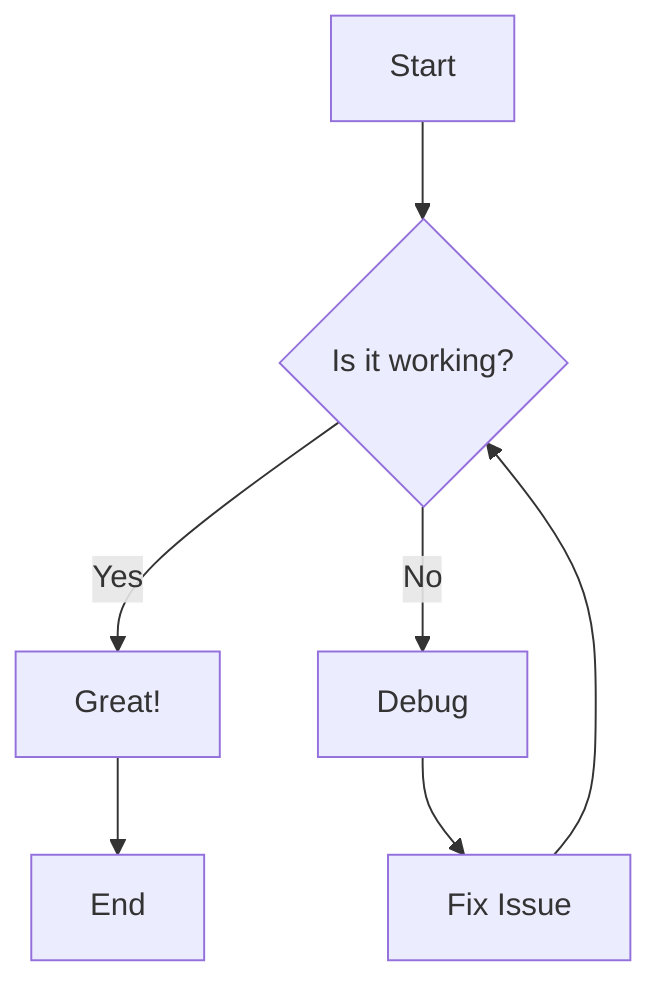
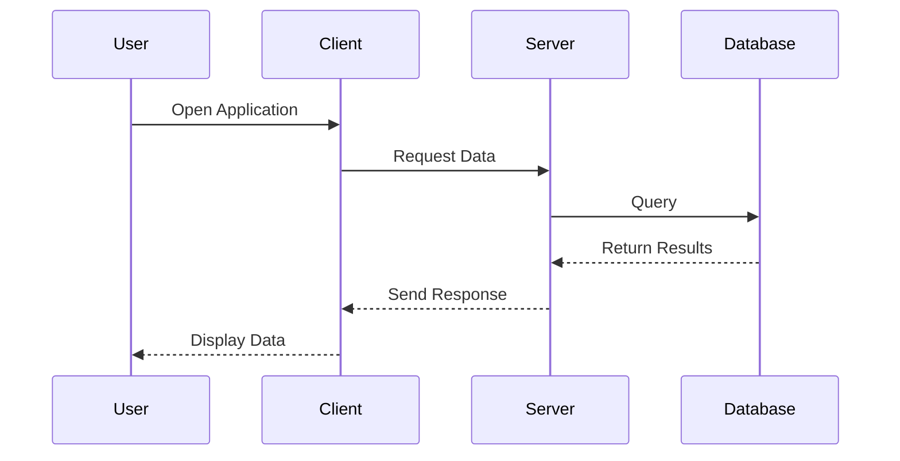
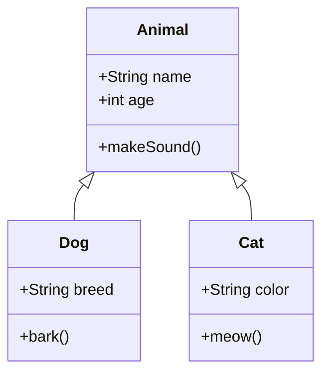
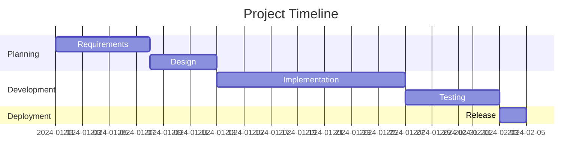

# Sample Markdown Document 1

This is the first sample markdown file demonstrating various markdown features for visual testing.

See also: [Sample Document 2](./sample2.md)

## Images

### Image from Internet


### Image from Local Disk


## Table

| Feature    | Supported | Priority |
| ---------- | --------- | -------- |
| Images     | ✅        | High     |
| Tables     | ✅        | High     |
| Mermaid    | ✅        | Medium   |
| ~~Legacy~~ | ❌        | Low      |

## Text Formatting

This text contains ~~strikethrough~~ formatting to demonstrate **bold**, _italic_, and ~~crossed out~~ text.

You can also combine them: **bold with ~~strikethrough~~** and _italic with ~~strikethrough~~_.

### Superscript and Subscript

Chemical formula: H<sub>2</sub>O

Mathematical notation: x<sup>2</sup> + y<sup>2</sup> = r<sup>2</sup>

Einstein's equation: E = mc<sup>2</sup>

## Footnotes

Here's a sentence with a footnote[^1]. And here's another one with a longer reference[^note].

[^1]: This is the first footnote.

[^note]:
    This is a longer footnote with multiple lines.
    It can contain multiple paragraphs and code.

## GitHub Alert Syntax

> [!NOTE]
> Useful information that users should know, even when skimming content.

> [!TIP]
> Helpful advice for doing things better or more easily.

> [!IMPORTANT]
> Key information users need to know to achieve their goal.

> [!WARNING]
> Urgent info that needs immediate user attention to avoid problems.

> [!CAUTION]
> Advises about risks or negative outcomes of certain actions.

## Code Blocks with Syntax Highlighting

### Rust Example

```rust
fn main() {
    let numbers = vec![1, 2, 3, 4, 5];
    let sum: i32 = numbers.iter().sum();
    println!("Sum: {}", sum);
}

struct Point {
    x: f64,
    y: f64,
}

impl Point {
    fn distance(&self, other: &Point) -> f64 {
        ((self.x - other.x).powi(2) + (self.y - other.y).powi(2)).sqrt()
    }
}
```

### JavaScript Example

```javascript
const greeting = (name) => {
  console.log(`Hello, ${name}!`);
};

class Calculator {
  add(a, b) {
    return a + b;
  }

  subtract(a, b) {
    return a - b;
  }
}
```

### Python Example

```python
def fibonacci(n):
    """Generate Fibonacci sequence up to n terms."""
    a, b = 0, 1
    result = []
    for _ in range(n):
        result.append(a)
        a, b = b, a + b
    return result

# Usage
print(fibonacci(10))
```

## Mathematical Expressions

### Inline Math

When $a \ne 0$, there are two solutions to $ax^2 + bx + c = 0$ and they are $x = {-b \pm \sqrt{b^2-4ac} \over 2a}$.

The famous equation $E = mc^2$ shows the relationship between energy and mass.

### Block Math (Display Mode)

$$
\int_{-\infty}^{\infty} e^{-x^2} dx = \sqrt{\pi}
$$

The Cauchy-Schwarz Inequality:

$$
\left( \sum_{k=1}^n a_k b_k \right)^2 \leq \left( \sum_{k=1}^n a_k^2 \right) \left( \sum_{k=1}^n b_k^2 \right)
$$

### Mathematical Notation

```math
\frac{d}{dx}\left( \int_{0}^{x} f(u)\,du\right)=f(x)
```

Sum notation using block syntax:

```math
\sum_{i=1}^{n} i = \frac{n(n+1)}{2}
```

## Mermaid Diagrams

### Flowchart



### Sequence Diagram



### Class Diagram



### Gantt Chart



---

[Next: Sample Document 2](./sample2.md)
