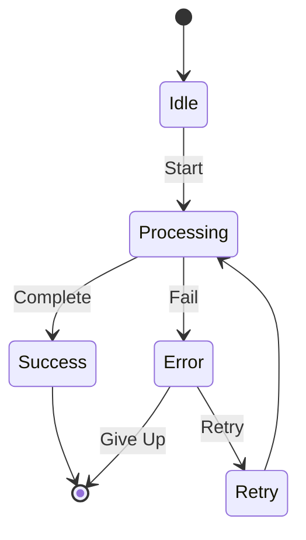
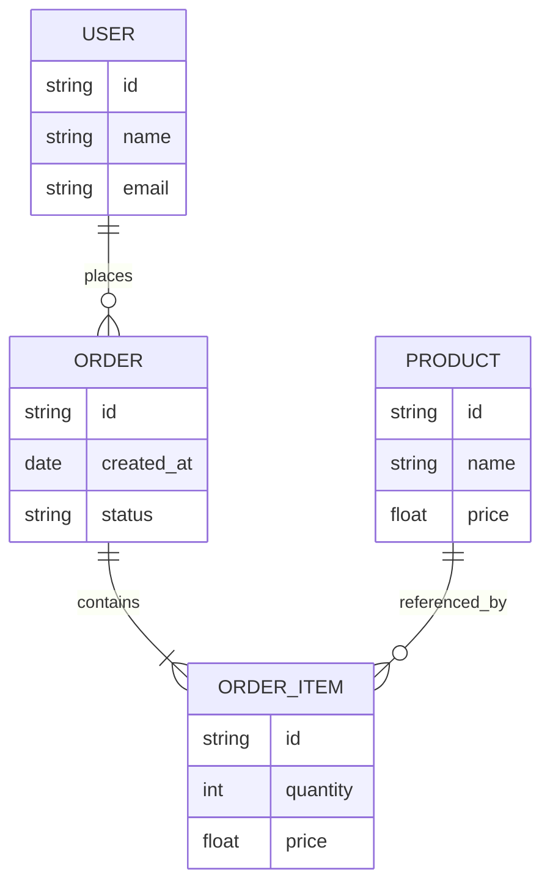
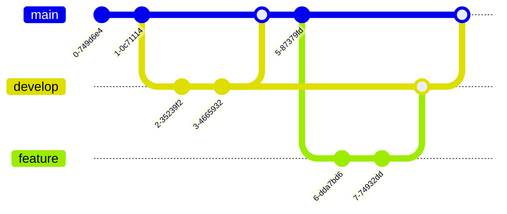

# Sample Markdown Document 2

This is the second sample markdown file that demonstrates additional markdown features and links back to the first document.

[← Back to Sample Document 1](./sample1.md)

## Additional Examples

This document complements [Sample Document 1](./sample1.md) with more markdown examples.

## Lists

### Unordered List

- First item
- Second item
  - Nested item 1
  - Nested item 2
    - Deeply nested item
- Third item

### Ordered List

1. Initialize project
2. Configure settings
   1. Set up environment
   2. Install dependencies
3. Start development

### Task List

- [x] Create sample markdown files
- [x] Add visual test elements
- [ ] Review and test rendering
- [ ] Deploy to production

## Blockquotes

> This is a simple blockquote.

> This is a multi-line blockquote.
> It can span multiple lines.
>
> And can even have multiple paragraphs.

Nested blockquotes:

> Level 1 quote
>> Level 2 quote
>>> Level 3 quote

## Horizontal Rules

Three ways to create horizontal rules:

---

***

___

## Links

- [External link to Rust](https://www.rust-lang.org/)
- [Link to Sample 1](./sample1.md)
- [Link with title](https://github.com "GitHub Homepage")
- Reference style link: [Rust Documentation][rust-docs]

[rust-docs]: https://doc.rust-lang.org/

## Inline Code and Math

Use `inline code` for short snippets. The function `std::io::stdin()` reads from standard input.

Variables like `x`, `y`, and `z` can be used in expressions.

## Collapsed Sections

<details>
<summary>Click to expand: Installation Instructions</summary>

### Prerequisites

- Rust 1.70 or higher
- Node.js 18 or higher
- Git

### Steps

1. Clone the repository
2. Run `cargo build`
3. Run `npm install` in the web directory
4. Start the application

</details>

<details>
<summary>Advanced Configuration</summary>

You can configure the application using environment variables:

```bash
export RUST_LOG=debug
export PORT=8080
```

Or use a `.env` file in the project root.

</details>

<details open>
<summary>This section is expanded by default</summary>

The `open` attribute makes this section visible by default.

</details>

## Diff Syntax

### Code Changes

```diff
fn calculate_sum(numbers: &[i32]) -> i32 {
-    let mut sum = 0;
-    for num in numbers {
-        sum += num;
-    }
-    sum
+    numbers.iter().sum()
}
```

### Configuration File Changes

```diff
[dependencies]
- tokio = "1.0"
+ tokio = { version = "1.0", features = ["full"] }
+ serde = { version = "1.0", features = ["derive"] }
```

## Definition Lists

<dl>
<dt>Markdown</dt>
<dd>A lightweight markup language with plain text formatting syntax.</dd>

<dt>GitHub Flavored Markdown (GFM)</dt>
<dd>GitHub's dialect of Markdown that adds features like tables, task lists, and syntax highlighting.</dd>

<dt>CommonMark</dt>
<dd>A strongly defined, highly compatible specification of Markdown.</dd>
</dl>

## Additional Code Examples

### Shell Script

```bash
#!/bin/bash

# Build and run the project
cargo build --release

# Run tests
cargo test --all

# Check formatting
cargo fmt --check
```

### TOML Configuration

```toml
[package]
name = "octoscope"
version = "0.1.0"
edition = "2021"

[dependencies]
tokio = { version = "1.0", features = ["full"] }
serde = { version = "1.0", features = ["derive"] }
```

### JSON Example

```json
{
  "name": "octoscope",
  "version": "0.1.0",
  "features": [
    "async",
    "serde",
    "tokio"
  ],
  "metadata": {
    "author": "Developer",
    "license": "MIT"
  }
}
```

## Advanced Mathematical Expressions

### Calculus

The derivative of a function $f(x)$ is defined as:

$$
f'(x) = \lim_{h \to 0} \frac{f(x+h) - f(x)}{h}
$$

### Complex Numbers

Euler's formula: $e^{i\pi} + 1 = 0$

The general form in block display:

$$
e^{ix} = \cos(x) + i\sin(x)
$$

### Linear Algebra

Identity matrix and its properties:

```math
I_n = \begin{bmatrix}
1 & 0 & \cdots & 0 \\
0 & 1 & \cdots & 0 \\
\vdots & \vdots & \ddots & \vdots \\
0 & 0 & \cdots & 1
\end{bmatrix}
```

Determinant formula:

$$
\det(A) = \sum_{\sigma \in S_n} \text{sgn}(\sigma) \prod_{i=1}^{n} a_{i,\sigma(i)}
$$

### Statistics and Probability

Normal distribution probability density function:

$$
f(x) = \frac{1}{\sigma\sqrt{2\pi}} e^{-\frac{1}{2}\left(\frac{x-\mu}{\sigma}\right)^2}
$$

Expected value and variance:

```math
E[X] = \sum_{i} x_i p(x_i), \quad \text{Var}(X) = E[(X - E[X])^2]
```

### Greek Letters and Symbols

Common mathematical symbols: $\alpha, \beta, \gamma, \Delta, \Sigma, \Omega$

Set theory: $\in, \subset, \cup, \cap, \emptyset$

Logical operators: $\forall, \exists, \land, \lor, \neg$

### Fractions and Binomials

Binomial coefficient:

$$
\binom{n}{k} = \frac{n!}{k!(n-k)!}
$$

Continued fraction:

$$
x = a_0 + \cfrac{1}{a_1 + \cfrac{1}{a_2 + \cfrac{1}{a_3 + \cdots}}}
$$

## More Mermaid Diagrams

### State Diagram



### Entity Relationship Diagram



### Git Graph



## Emoji

This document was created with care! 🎉 🚀 ✨

## References

For more information, check out:
- [Sample Document 1](./sample1.md) - Main visual test document
- [Markdown Guide](https://www.markdownguide.org/)
- [GitHub Flavored Markdown](https://github.github.com/gfm/)
- [Mermaid Documentation](https://mermaid.js.org/)

---

[← Back to Sample Document 1](./sample1.md)
